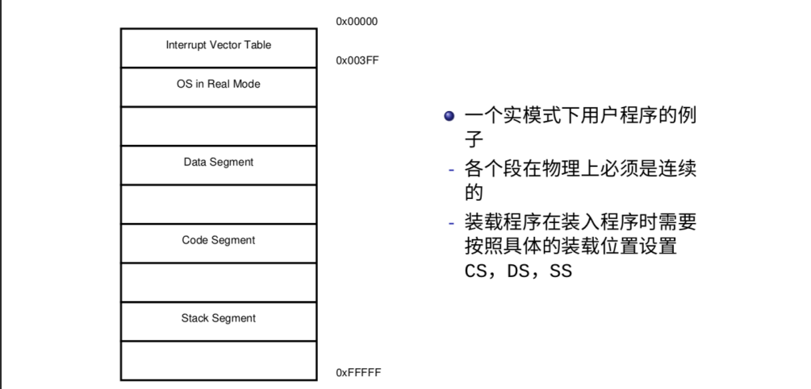

# ☺ 实模式

8086为16位CPU，有16位的寄存器（Register），16位的数据总线（Data Bus），20位的地址总线 （Address Bus），寻址能力为1MB。

1. 8086 的寄存器集合
   * 通用寄存器(16 位): AX，BX，CX，DX，SP，BP，DI，SI
   * 段寄存器(16 位): CS，DS，SS，ES
   * 状态和控制寄存器(16 位): FLAGS，IP
2. 寻址空间与寻址方式
   * 采用实地址空间进行访存，寻址空间为 2^20
   * 物理地址 = 段寄存器 << 4 + 偏移地址
   * 举个例子：`CS=0x0000:IP=0x7C00` 和 `CS=0x0700:IP=0x0C00` 以及 `CS=0x7C0:IP=0x0000` 所寻地址是完全一致的
3. 8086的中断
   * 中断向量表存放在物理内存的开始位置(`0x0000`至`0x03FF`)
   * 最多可以有 256 个中断向量
   * `0x00` 至 `0x07` 号中断为系统专用
   * `0x08` 至 `0x0F`，`0x70` 至 `0x77` 号硬件中断为 8259A 使用

8086的中断处理是交给BIOS完成的，实模式下可以通过 int $0x10 中断进行屏幕上的字符串显示，具体细节请参考BIOS中断向量表或自行查找资料。


exercise4：中断向量表是什么？你还记得吗？请查阅相关资料，并在报告上说明。做完[《写一个自己的MBR》](../../kai-shi-shi-yan/xie-yi-ge-zi-ji-de-mbr/)这一节之后，再简述一下示例MBR是如何输出helloworld的。


实模式或者说8086本身有一些缺点

* 安全性问题
  * 程序采用物理地址来实现访存，**无法实现对程序的代码和数据的保护**（划重点）
  * 一个程序可以通过改变段寄存器和偏移寄存器访问并修改不属于自己的代码和数据
* 分段机制本身的问题
  * 段必须是连续的，从而无法利用零碎的空间
  * 段的大小有限制(最大为 `64KB`)，从而限制了代码的规模


exercise5：为什么段的大小最大为64KB，请在报告上说明原因。


因为一些问题，我们需要开启保护模式......请看下节。

