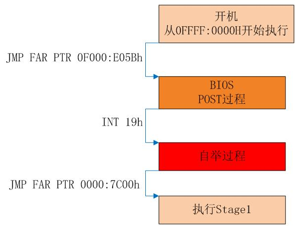

# 😀 了解BIOS

### BIOS的初始化

刚刚发现，`BIOS`的第一条指令会跳转到某个更低地址的部分。那么，他会做什么呢？请用`si`往下看看！


exercise3：继续用`si`看见了什么？请截一个图，放到实验报告里。


这里稍微解释一下。

* 首先，设置了`ss`和`esp`寄存器
* 然后通过`cli`指令屏蔽了中断
* `cld`和后面的`in`和`out`指令相关（暂时不用管）
* 然后通过`in`，`out`指令和`IO`设备交互，进行初始化，打开`A20`门（暂时不用管）
* 然后用`lidtw`与`lgdtw`加载`IDTR`与`GDTR`（`ICS`学过，跟保护模式有关）
* 最后开启保护模式，长跳转到`BIOS`的主要模块进行执行

下面是BIOS执行的全过程，在jmp far之后，关闭保护模式，开启实模式，跳转到Stage1执行，其中Stage1就是我们前面说的**MBR（即bootloader）！！！**

\

### POST（不必了解）

至于POST过程，其实不必了解，但我还是提一下，如下：

1）初始化各种主板芯片组

2）初始化键盘控制器8042

3）初始化中断向量 ，中断服务例程.

4）初始化 VGA BIOS 控制器

5）显示BIOS的版本和公司名称

6）扫描软驱和各种介质容量

7）读取CMOS的启动顺序配置，并检测启动装置是否正常

8）调用INT 19h启动自举程序

### 自举过程

这个实际上就是把MBR的内容从磁盘调入地址为0x7c00的地方。

